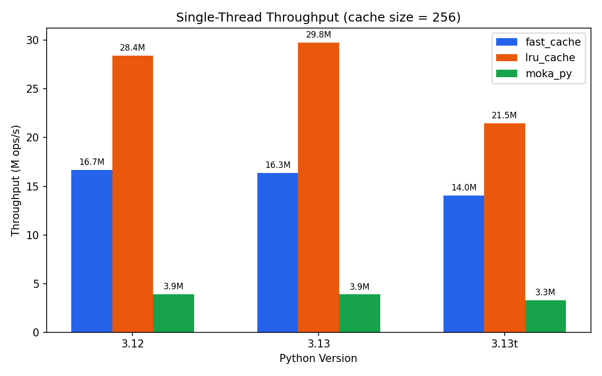
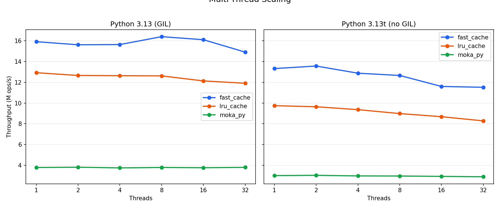
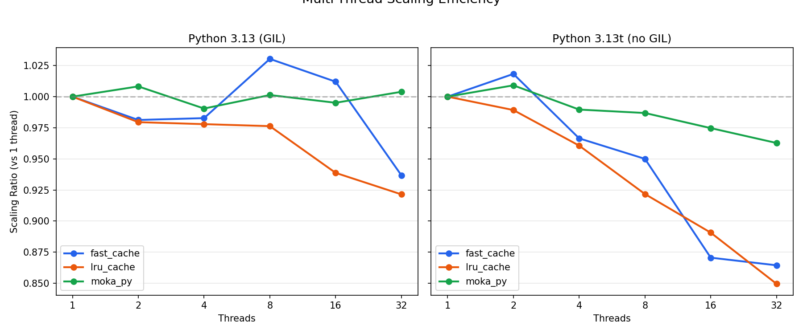
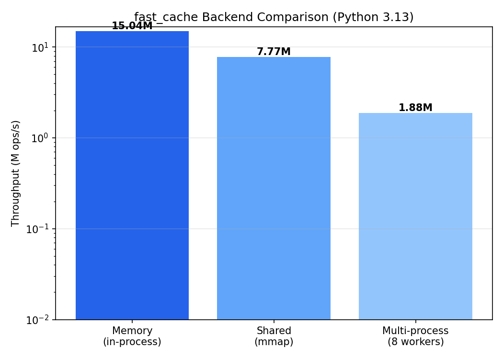

# warp_cache vs lru_cache vs moka_py

A deep comparison of three Python caching libraries: **warp_cache** (Rust/PyO3), **lru_cache** (CPython builtin), and **moka_py** (Rust/PyO3, port of Java's Caffeine).

*Benchmarks: Apple M-series (arm64), Zipf-distributed keys (2000 unique), 100K ops per config, `time.perf_counter()`.*

---

## TL;DR

| Scenario | warp_cache | lru_cache | moka_py |
|---|---:|---:|---:|
| Single-thread (3.13, cache=256) | 16.3M ops/s | 29.8M ops/s | 3.9M ops/s |
| Single-thread (3.13t, no GIL) | 14.0M ops/s | 21.5M ops/s | 3.3M ops/s |
| Multi-thread 8T (3.13, GIL) | 16.4M ops/s | 12.6M ops/s (+Lock) | 3.8M ops/s |
| Multi-thread 8T (3.13t, no GIL) | 12.7M ops/s | 9.0M ops/s (+Lock) | 3.0M ops/s |
| Shared memory (3.13, single proc) | 7.8M ops/s | N/A | N/A |
| Thread-safe (builtin) | Yes | No | Yes |
| Async support | Yes | No | No |
| Cross-process shared memory | Yes | No | No |
| Eviction strategies | LRU/MRU/FIFO/LFU | LRU | LRU/LFU/FIFO |
| TTL support | Yes | No | Yes |

**Bottom line:** `lru_cache` is fastest single-threaded (it's C code inside CPython with zero overhead). `warp_cache` is the fastest *thread-safe* cache, 1.3x faster than `lru_cache+Lock` under the GIL and 1.4x faster without it. `moka_py` is 4-5x slower than `warp_cache` despite also being Rust. The shared memory backend reaches ~7.8M ops/s via seqlock-based optimistic reads — only ~2x slower than the in-process backend.

---

## The GIL Question

### What the GIL means for caching

Python's Global Interpreter Lock (GIL) serializes all Python bytecode execution. This has two consequences for caches:

1. **`lru_cache` doesn't need a lock.** The GIL guarantees that only one thread touches the cache at a time. This is why it's so fast — zero synchronization overhead.

2. **Thread-safe caches pay a tax.** Any cache that uses its own lock (like `warp_cache`'s `parking_lot::RwLock`) pays ~8ns per operation even though the GIL already serializes access. This is the price of correctness under free-threaded Python.

### Free-threaded Python 3.13t

Python 3.13 introduced an experimental free-threaded mode (`python3.13t`) that disables the GIL entirely. This changes the equation:

- **`lru_cache` becomes unsafe.** Without the GIL, concurrent reads/writes corrupt internal state. You *must* wrap it in `threading.Lock()`, adding contention overhead.
- **`warp_cache` already has the lock.** Its `RwLock` enables true parallel reads across cores — multiple threads can read the cache simultaneously with no contention.
- **Everything gets ~15-20% slower.** Atomic reference counting (replacing the GIL's implicit refcount protection) adds overhead to all Python objects. This affects every library equally.

### warp_cache's read-lock architecture

The key insight: most cache operations are **reads** (cache hits). `warp_cache` uses a read-write lock where cache hits only acquire a *read lock* — multiple threads read simultaneously. Only cache misses require a write lock.

This means under real workloads with high hit rates (typical for caches), contention is near-zero even with many threads.

---

## Single-Thread Performance



### Why lru_cache wins single-threaded

`lru_cache` is unbeatable in single-threaded scenarios because it pays almost nothing:

| Operation | lru_cache (C) | warp_cache (Rust) | Delta |
|---|---:|---:|---:|
| Call dispatch (`tp_call`) | ~5ns | ~10ns | +5ns |
| Hash args (`PyObject_Hash`) | ~15ns | ~15ns | 0 |
| Table lookup + key equality | ~10ns | ~12ns | +2ns |
| LRU reorder (linked list) | ~5ns | ~8ns | +3ns |
| **Lock acquire + release** | **0ns** | **~8ns** | **+8ns** |
| Refcount management | ~2ns | ~5ns | +3ns |
| Return value | ~2ns | ~2ns | 0 |
| **Total** | **~39ns** | **~60ns** | **+21ns (~34ns measured)** |

The three categories of overhead:

1. **Irreducible: Thread safety lock (~8ns)** — `lru_cache` pays nothing because the GIL provides implicit safety. `warp_cache` pays ~8ns for `parking_lot::RwLock`. Cannot be eliminated without removing thread safety.

2. **Structural: PyO3 call dispatch (~5ns)** — PyO3's `tp_call` shim extracts GIL tokens, validates and converts argument pointers. `lru_cache` receives raw `PyObject*` directly. Inherent to using a safe FFI layer.

3. **Marginal: Reference counting (~3ns)** — `lru_cache` uses the args tuple pointer as-is. `warp_cache` does `Py_INCREF` to own it in `CacheKey`, then `Py_DECREF` on drop. Cost of Rust's ownership model.

### Why warp_cache beats moka_py 4-5x

Both are Rust + PyO3, yet `warp_cache` is **4.2x faster** (16.3M vs 3.9M ops/s on Python 3.13). The differences:

1. **Single FFI crossing.** `warp_cache` does the entire lookup — hash, find, equality check, LRU reorder, return — in one Rust `__call__`. `moka_py` crosses the FFI boundary multiple times.

2. **Static dispatch.** `warp_cache` uses an `enum` over strategy types (`StrategyEnum`), allowing the compiler to inline and devirtualize. No `Box<dyn>` indirection.

3. **Precomputed hash + raw C equality.** `CacheKey` stores the Python hash once and uses `ffi::PyObject_RichCompareBool` directly — the same raw C call that `lru_cache` uses.

4. **No serialization.** The in-memory backend stores `Py<PyAny>` directly. No pickle, no copies.

---

## Multi-Thread Performance





### GIL mode (Python 3.13)

Under the GIL, `warp_cache` maintains ~16M ops/s regardless of thread count. This is remarkable — adding threads doesn't slow it down because:

- The `RwLock` is uncontended (the GIL serializes access anyway)
- Atomic hit/miss counters use `Ordering::Relaxed` — no memory barriers
- The deferred access log batches LRU updates, reducing write-lock contention

Meanwhile, `lru_cache + Lock` drops to ~12.6M ops/s. The `threading.Lock()` wrapper adds Python-level function call overhead on every access.

### No-GIL mode (Python 3.13t)

Without the GIL, the story is similar but shifted down ~15-20% across the board due to atomic reference counting overhead:

- **warp_cache: ~12.7M ops/s** — stable across thread counts
- **lru_cache + Lock: ~9.0M ops/s** — degrades slightly with contention
- **moka_py: ~3.0M ops/s** — stable but slow

`warp_cache` leads by **1.4x** over `lru_cache+Lock` — its RwLock architecture specifically benefits here because multiple readers can proceed in parallel without the GIL's serialization.

### Why warp_cache doesn't scale *up* with threads

Under the GIL, adding threads can't increase throughput because only one thread runs at a time. The GIL turns parallelism into concurrency.

Under no-GIL, `warp_cache` could theoretically scale reads across cores. In practice, the benchmark workload is CPU-bound with very short operations (~70ns each), so thread scheduling overhead dominates any parallelism gains. For I/O-bound workloads with expensive cache misses, the read-lock architecture would show clear scaling benefits.

---

## Why warp_cache Is Fast — Architecture Deep Dive

### 1. Single FFI crossing

The entire cache lookup happens in Rust's `__call__` method. Python calls `cached_fn(42)`, which enters Rust once and returns the cached value. No Python wrapper function, no intermediate objects.

```
Python: fn(42)
  └─ tp_call (PyO3) ─────────────────────────────── one FFI crossing
       ├─ hash(args)           via ffi::PyObject_Hash
       ├─ HashMap lookup       Rust hashbrown, precomputed hash
       ├─ equality check       via ffi::PyObject_RichCompareBool
       ├─ RwLock (read)        parking_lot, ~8ns uncontended
       └─ return cached value
```

### 2. Read-lock fast path + deferred access log

Cache hits acquire only a **read lock** (`store.rs` lines 110-139). The LRU reorder is deferred — instead of immediately promoting the accessed key (which would require a write lock), the key is pushed to a bounded access log. The log is drained on the next cache miss (under a write lock).

This means cache hits under high hit rates (~65%+ in these benchmarks) almost never contend for the write lock.

### 3. Enum static dispatch

Eviction strategies are dispatched via a Rust `enum` (`StrategyEnum`) with `#[inline(always)]` on every method. The compiler knows all variants at compile time and can inline the specific strategy code directly into the hot path. Compare with `Box<dyn EvictionStrategy>`, which requires vtable indirection on every call.

### 4. Precomputed hash + raw C API equality

`CacheKey` computes `PyObject_Hash` once at key creation and stores the result. HashMap lookups use the precomputed hash directly. Key equality uses raw `ffi::PyObject_RichCompareBool` — the exact same C call that `lru_cache` uses — bypassing PyO3's safe-but-slower `Python::with_gil` wrapper.

### 5. parking_lot::RwLock (~8ns)

`parking_lot` provides a significantly faster mutex than `std::sync::RwLock` (~8ns vs ~25ns uncontended on arm64). It uses adaptive spinning before parking, reducing syscall overhead.

### 6. Fat LTO + codegen-units=1

The release profile enables fat link-time optimization across all crates (including PyO3) and forces single-codegen-unit compilation. This allows the compiler to inline PyO3's FFI wrappers directly into `warp_cache`'s hot path, eliminating call overhead at the boundary.

```toml
[profile.release]
lto = "fat"
codegen-units = 1
```

### 7. Atomic hit/miss counters

Hit and miss counts use `AtomicU64` with `Ordering::Relaxed` — no memory barriers, no cache-line bouncing on single-socket machines. Stats collection is essentially free.

---

## Cross-Process Shared Memory



`warp_cache` is the only library in this comparison that supports cross-process caching via mmap'd shared memory. This enables multiple Python processes to share a single cache without serialization overhead of Redis/Memcached.

| Backend | Throughput | Use case |
|---|---:|---|
| Memory (in-process) | ~15.0M ops/s | Single process, maximum speed |
| Shared (mmap, single process) | ~7.8M ops/s | Cross-process capable, near lock-free reads |
| Shared (mmap, 8 processes) | ~1.9M ops/s total | Multiple concurrent processes |

The shared backend uses:
- **mmap'd files** (`$TMPDIR/warp_cache/{name}.cache`) for zero-copy access
- **Seqlock** in shared memory for cross-process synchronization — reads are optimistic and lock-free (~10-20ns), only writes acquire a spinlock
- **Open-addressing hash table** with linear probing (power-of-2 capacity for bitmask)
- **Pickle serialization** for values (required for cross-process compatibility)
- **Atomic stats** — `hits`, `misses`, and `oversize_skips` use `AtomicU64`, so `info()` and `record_oversize_skip()` never acquire a lock

The read path splits into two phases: (1) an optimistic lock-free hash lookup + value copy under the seqlock, retried if a writer was active; (2) a brief write lock only when ordering needs updating (LRU/MRU/LFU hit). FIFO cache hits are fully lock-free. TTL-expired entries are detected during the optimistic read, then cleaned up under the write lock with re-verification.

The ~2x throughput gap between memory and shared backend is dominated by pickle serialization (the lock itself is near-free on the read path). The shared backend is still orders of magnitude faster than network-based caches (Redis: ~100-500K ops/s over localhost).

---

## Feature Matrix

| Feature | warp_cache | lru_cache | moka_py |
|---|---|---|---|
| Implementation | Rust (PyO3) | C (CPython builtin) | Rust (PyO3) |
| Thread-safe (builtin) | Yes (`RwLock`) | No (needs `Lock` wrapper) | Yes |
| Async support | Yes (auto-detect) | No | No |
| Cross-process (shared mem) | Yes (mmap) | No | No |
| TTL support | Yes | No | Yes |
| LRU eviction | Yes | Yes | Yes |
| LFU eviction | Yes | No | Yes |
| FIFO eviction | Yes | No | Yes |
| MRU eviction | Yes | No | No |
| Cache statistics | Yes (hits/misses) | Yes (hits/misses) | No |
| `cache_clear()` | Yes | Yes | No |
| Decorator API | `@cache()` | `@lru_cache()` | `Moka(maxsize)` |
| Python version | 3.9+ | Any | 3.8+ |
| Free-threaded ready | Yes | No (needs Lock) | Yes |

---

## Methodology

**Machine:** Apple M-series (arm64), macOS

**Python versions tested:**
- Python 3.12.0 (GIL)
- Python 3.13.2 (GIL)
- Python 3.13.2 free-threaded (no GIL)

**Workload:** Zipf-distributed keys (alpha=1.0) over 2000 unique values, producing ~65% cache hit rate at maxsize=256. This models realistic access patterns where some keys are much hotter than others.

**Thread safety wrapping:** `lru_cache` and `cachetools` are not thread-safe, so multi-threaded benchmarks wrap them in `threading.Lock()`. `warp_cache` and `moka_py` are used directly (builtin thread safety).

**Timing:** `time.perf_counter()` with 100K operations per configuration. Sustained benchmarks run for 10 seconds. Results are the most recent run; variance across runs is typically <5%.

**Library versions:** warp_cache 0.1.0, moka_py 0.3.0, cachetools 7.0.1

**Source data:** `benchmarks/results/bench_py3.12.json`, `bench_py3.13.json`, `bench_default.json` (3.13t)

**Charts generated by:** `benchmarks/_generate_comparison_charts.py`

---

*Generated from benchmark data. See `benchmarks/` for full source and raw results.*
