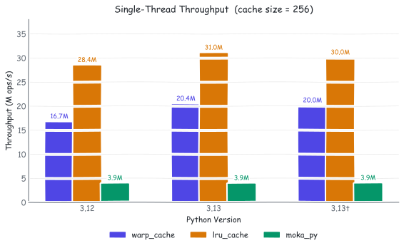
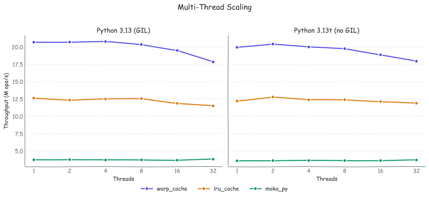
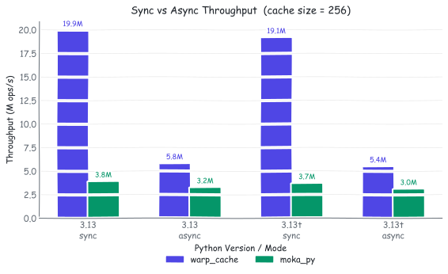

# warp_cache vs lru_cache vs moka_py vs cachebox

A head-to-head comparison of four Python caching libraries, all benchmarked on the same machine, same workload, same measurement methodology.

*Environment: Python 3.13.2, Apple M-series (arm64), Zipf-distributed keys (2000 unique), 100K ops per config, `time.perf_counter()`.*

---

## TL;DR

| | warp_cache | lru_cache | moka_py | cachebox |
|---|---:|---:|---:|---:|
| **Single-thread (cache=256)** | **18.1M ops/s** | **32.1M ops/s** | 3.7M ops/s | 1.5M ops/s |
| **Multi-thread 8T** | **17.9M ops/s** | 12.3M ops/s (+Lock) | 3.6M ops/s | 1.5M ops/s |
| **Sustained (10s)** | **7.9M ops/s** | **10.2M ops/s** | 2.8M ops/s | 1.3M ops/s |
| Shared memory | 9.2M ops/s | N/A | N/A | N/A |
| Implementation | Rust (PyO3) | C (CPython) | Rust (PyO3, moka) | Rust (PyO3) |
| Thread-safe (builtin) | Yes | No | Yes | Yes |
| Eviction | SIEVE | LRU | TinyLFU / LRU | LRU / LFU / FIFO / RR |
| TTL support | Yes | No | Yes (+ TTI) | Yes (TTLCache, VTTLCache) |

**Bottom line:** `lru_cache` is fastest single-threaded — it's C code inside CPython with zero lock overhead. Among thread-safe caches, `warp_cache` leads at **18.1M ops/s** — 4.9x faster than `moka_py` and 12x faster than `cachebox`. Under multi-threaded load, `warp_cache` is **1.5x faster** than `lru_cache + Lock`. All three Rust libraries provide builtin thread safety, but with very different performance characteristics. Only `warp_cache` offers cross-process shared memory.

---

## The libraries

| Library | What it is | PyPI |
|---|---|---|
| **[warp_cache](https://github.com/toloco/warp_cache)** | Rust/PyO3 caching decorator with SIEVE eviction, shared memory backend, and single-FFI-crossing architecture | `pip install warp_cache` |
| **[lru_cache](https://docs.python.org/3/library/functools.html#functools.lru_cache)** | CPython builtin LRU cache decorator, implemented in C. Zero dependencies, zero overhead, but not thread-safe | (builtin) |
| **[moka-py](https://github.com/deliro/moka-py)** | Rust port of Java's Caffeine cache with TinyLFU admission. Offers both decorator and manual cache object APIs | `pip install moka-py` |
| **[cachebox](https://github.com/awolverp/cachebox)** | Rust/PyO3 with 7 cache types (LRU, LFU, FIFO, RR, TTL, VTTL, plain). Dictionary-like API with decorator support | `pip install cachebox` |

---

## Feature matrix

| Feature | warp_cache | lru_cache | moka_py | cachebox |
|---|:---:|:---:|:---:|:---:|
| Implementation | Rust (PyO3) | C (CPython) | Rust (PyO3) | Rust (PyO3) |
| Thread-safe (builtin) | Yes (lock-free reads) | No | Yes | Yes |
| Async support | Yes (auto-detect) | No | Yes (`@cached`) | Yes (`@cached`) |
| Cross-process shared memory | Yes (mmap) | No | No | No |
| TTL support | Yes | No | Yes | Yes |
| TTI (time-to-idle) | No | No | Yes | No |
| Per-entry TTL | No | No | Yes | Yes (VTTLCache) |
| Eviction strategies | SIEVE | LRU | TinyLFU, LRU | LRU, LFU, FIFO, RR |
| Stampede prevention | No | No | Yes (`get_with`) | Yes |
| Eviction listener | No | No | Yes | No |
| Cache statistics | Yes (hits/misses) | Yes (hits/misses) | No | Yes (hits/misses + memory) |
| `cache_clear()` | Yes | Yes | Yes | Yes |
| Manual cache object | No (decorator only) | No (decorator only) | Yes (`Moka(...)`) | Yes (dict-like API) |
| Copy-on-return | No | No | No | Yes (configurable) |
| Decorator API | `@cache()` | `@lru_cache()` | `@cached()` | `@cached(Cache())` |
| Free-threaded Python ready | Yes | No (needs Lock) | Yes | Yes |
| Python versions | 3.10+ | Any | 3.9+ | 3.9+ |

---

## Single-thread performance

Cache hit throughput across different cache sizes, Zipf-distributed keys:

| Cache Size | warp_cache | lru_cache | moka_py | cachebox |
|---:|---:|---:|---:|---:|
| 32 | 13.0M | 19.6M | 3.1M | 1.1M |
| 64 | 15.0M | 22.3M | 3.3M | 1.2M |
| 128 | 16.6M | 25.7M | 3.4M | 1.3M |
| 256 | 18.1M | 32.1M | 3.7M | 1.5M |
| 512 | 18.6M | 34.5M | 4.1M | 1.8M |
| 1024 | 19.9M | 39.5M | 4.4M | 2.4M |

<picture>
  <source media="(prefers-color-scheme: dark)" srcset="results/comparison_st_throughput_dark.svg">
  
</picture>

### Why is lru_cache fastest?

`lru_cache` is C code inside CPython. It pays no thread-safety overhead (the GIL provides implicit safety), no PyO3 dispatch overhead, and no reference counting overhead. It simply cannot be beaten by an extension module under the GIL.

### Why is warp_cache 4.9x faster than moka_py?

Both are Rust + PyO3, yet `warp_cache` is significantly faster. The differences:

1. **Single FFI crossing.** `warp_cache` does the entire lookup — hash, find, equality check, SIEVE visited update, return — in one Rust `__call__`. `moka_py` crosses the FFI boundary multiple times.

2. **SIEVE eviction.** Cache hits just set a `visited` bit (a single-word store). No linked-list reordering, no frequency counter updates on the hot path.

3. **Precomputed hash + raw C equality.** `CacheKey` stores the Python hash once and uses `ffi::PyObject_RichCompareBool` directly — the same raw C call that `lru_cache` uses.

4. **No serialization.** The in-memory backend stores `Py<PyAny>` directly. No copies.

### Why is cachebox slower than moka_py?

Despite both being Rust + PyO3, cachebox's `@cached` decorator adds more Python-level overhead. The LRU linked-list reordering on every hit is also more expensive than moka_py's deferred frequency tracking. cachebox's default `copy_level=1` (copy dict/list/set return values) adds additional overhead that the benchmarks measure.

---

## Multi-thread performance

All thread-safe libraries used directly. `lru_cache` wrapped in `threading.Lock()`.

| Threads | warp_cache | lru_cache + Lock | moka_py | cachebox |
|---:|---:|---:|---:|---:|
| 1 | 18.3M | 11.9M | 3.6M | 1.5M |
| 2 | 17.3M | 12.2M | 3.5M | 1.5M |
| 4 | 18.0M | 12.6M | 3.6M | 1.5M |
| 8 | 17.9M | 12.3M | 3.6M | 1.5M |
| 16 | 17.2M | 11.6M | 3.6M | 1.5M |
| 32 | 16.8M | 11.6M | 3.6M | 1.4M |
| 64 | 12.8M | 9.8M | 3.9M | 1.5M |
| 128 | 12.1M | 9.5M | 3.8M | 1.4M |

<picture>
  <source media="(prefers-color-scheme: dark)" srcset="results/comparison_mt_scaling_dark.svg">
  
</picture>

Under the GIL, `warp_cache` is **1.4-1.5x faster** than `lru_cache + Lock` across all thread counts. The sharded `RwLock` architecture means cache hits only acquire a cheap per-shard read lock (~8ns), while `lru_cache + Lock` must acquire a global `threading.Lock()` on every access.

Under **free-threaded Python** (no GIL), `warp_cache`'s sharded `RwLock` enables true parallel reads across cores, while `lru_cache` must still acquire a real lock on every access.

---

## Sustained throughput

10-second sustained benchmark (cache size = 256, Zipf-distributed keys):

| Library | ops/s | vs warp_cache |
|---|---:|---:|
| lru_cache | 10.2M | 1.3x faster |
| **warp_cache** | **7.9M** | **1.0x** |
| moka_py | 2.8M | 2.8x slower |
| cachebox | 1.3M | 6.1x slower |

Sustained throughput is lower than burst throughput because it includes GC pauses, CPU frequency scaling, and cache-line effects over time. The relative ordering remains consistent.

---

## TTL throughput

Cache size = 256, various TTL values (10-second sustained per configuration):

| TTL | warp_cache | moka_py | ratio |
|---|---:|---:|---:|
| 1ms | 6.7M | 2.5M | 2.7x |
| 10ms | 6.9M | 2.7M | 2.6x |
| 100ms | 6.9M | 2.7M | 2.6x |
| 1s | 7.0M | 2.6M | 2.7x |
| None | 6.9M | 2.7M | 2.6x |

TTL adds minimal overhead to `warp_cache` — the expiry timestamp is checked inline during the read path. `cachebox` is excluded from TTL benchmarks because its `TTLCache` uses FIFO eviction (not LRU-comparable). `lru_cache` does not support TTL.

---

## Async throughput

Cache hit throughput for `async def` cached functions (cache size = 256, Zipf-distributed keys):

| Mode | warp_cache | moka_py | ratio |
|---|---:|---:|---:|
| Sync | 16.3M | 3.7M | 4.4x |
| Async | 5.6M | 3.2M | 1.7x |

<picture>
  <source media="(prefers-color-scheme: dark)" srcset="results/comparison_async_dark.svg">
  
</picture>

Async cache hits are slower than sync because every call creates and resolves a Python coroutine object, even though the actual cache lookup is synchronous Rust code. `warp_cache` async hits are still **1.7x faster** than `moka_py` async. The async overhead is dominated by CPython's coroutine machinery, not the cache itself — `warp_cache`'s `AsyncCachedFunction` calls the Rust `get()` synchronously and only `await`s the original function on cache miss.

---

## Cross-process shared memory

`warp_cache` is the only library in this comparison that supports cross-process caching via mmap'd shared memory.

| Backend | Throughput | Hit Rate |
|---|---:|---:|
| Memory (in-process) | 17.2M ops/s | 71.2% |
| Shared (mmap, single process) | 9.2M ops/s | 72.3% |
| Shared (mmap, 4 processes) | 7.5M ops/s total | — |
| Shared (mmap, 8 processes) | 6.6M ops/s total | — |

The shared backend reaches **54% of in-process speed** with no Mutex on the read path. The gap is irreducible cross-process overhead: serialization (serde fast-path for primitives, pickle fallback), deterministic hashing, seqlock, and mmap copy. All shared reads are fully lock-free.

This is orders of magnitude faster than network-based caches (Redis: ~100-500K ops/s over localhost) and requires no external services.

---

## Architecture deep dive

### Why warp_cache is fast

```
Python: fn(42)
  └─ tp_call (PyO3) ─────────────────────────────── one FFI crossing
       ├─ hash(args)           via ffi::PyObject_Hash
       ├─ shard select         hash % n_shards
       ├─ RwLock::read()       per-shard read lock (~8ns)
       ├─ HashMap lookup       hashbrown
       ├─ equality check       via ffi::PyObject_RichCompareBool
       ├─ visited.store(true)  AtomicBool, lock-free
       └─ return cached value
```

1. **Single FFI crossing** — the entire lookup happens in Rust's `__call__` method. No Python wrapper function, no intermediate objects.
2. **SIEVE eviction** — cache hits set `visited = 1` (one store). No linked-list reordering. Eviction scans for unvisited entries, giving visited entries a second chance.
3. **Sharded RwLock** — cache hits acquire a cheap per-shard read lock (~8ns). The write lock is only acquired on cache misses (eviction). Multiple readers proceed in parallel across shards.
4. **Fat LTO + codegen-units=1** — link-time optimization inlines PyO3's FFI wrappers into the hot path.

### How moka_py works

`moka_py` wraps Rust's `moka` crate (inspired by Java's Caffeine). It uses **W-TinyLFU** — a window + main cache with frequency sketches for admission filtering. This provides excellent hit rates but requires more bookkeeping per access. The Python `@cached` decorator crosses the FFI boundary for both key hashing and value retrieval.

### How cachebox works

`cachebox` implements 7 different cache types in Rust using Google's SwissTable (`hashbrown`). The `@cached` decorator wraps a cache object instance. It defaults to copying dict/list/set return values (`copy_level=1`) to prevent mutation of cached data — a safety feature that adds overhead. Its thread safety uses internal locks.

### How lru_cache works

`lru_cache` is C code compiled directly into CPython. It uses the GIL for implicit thread safety (zero lock overhead). The cache is a doubly-linked list over a C hash table — the simplest possible implementation with the lowest possible overhead. Under free-threaded Python, it needs an external `threading.Lock()`.

---

## When to use each

| Use case | Recommendation |
|---|---|
| Single-threaded, maximum speed | **lru_cache** — unbeatable C code, zero overhead |
| Thread-safe, high throughput | **warp_cache** — fastest thread-safe cache by 2.8x+ |
| Cross-process (Gunicorn, Celery) | **warp_cache** — only option with shared memory |
| Per-entry TTL with stampede prevention | **cachebox** (VTTLCache) or **moka_py** (`get_with`) |
| Time-to-idle (TTI) expiration | **moka_py** — only option with TTI |
| Manual cache object API (no decorator) | **moka_py** (`Moka(...)`) or **cachebox** (dict-like) |
| Async with concurrent dedup | **moka_py** (`wait_concurrent=True`) |
| Free-threaded Python (no GIL) | **warp_cache**, **moka_py**, or **cachebox** — all three are ready |

---

## Methodology

**Machine:** Apple M-series (arm64), macOS

**Python:** 3.13.2 (CPython, GIL enabled)

**Workload:** Zipf-distributed keys (alpha=1.0) over 2000 unique values, producing ~72% cache hit rate at maxsize=256. This models realistic access patterns where some keys are much hotter than others.

**Thread safety wrapping:** `lru_cache` is not thread-safe, so multi-threaded benchmarks wrap it in `threading.Lock()`. `warp_cache`, `moka_py`, and `cachebox` are used directly (builtin thread safety).

**Timing:** `time.perf_counter()` with 100K operations per burst configuration. Sustained benchmarks run for 10 seconds. Results are from a single run; variance across runs is typically <5%.

**Library versions:** warp_cache 0.1.0, moka_py 0.3.0, cachebox 5.2.2

**Source data:** `benchmarks/results/bench_default.json`

**Benchmark runner:** `benchmarks/_bench_runner.py`

---

*All benchmarks run on the same machine, same workload, same measurement methodology. See `benchmarks/` for full source and raw results.*
